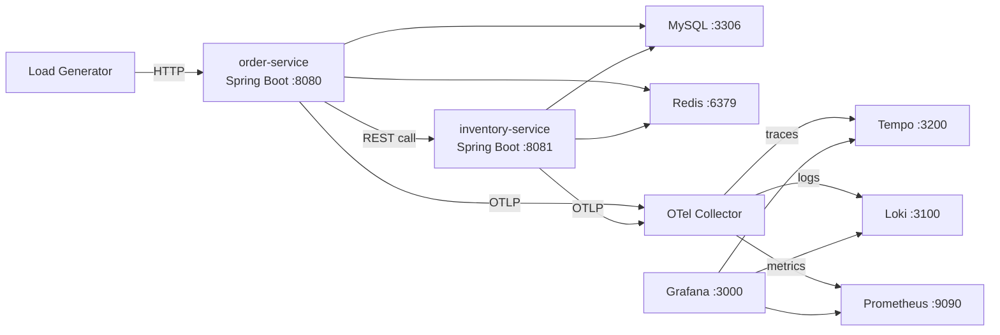

# OpenTelemetry + Grafana Observability Demo

A complete local observability demo showcasing OpenTelemetry Java Agent zero-code instrumentation with Grafana stack (Tempo, Loki, Prometheus). Includes built-in chaos engineering for fault injection drills.

## Features

- **Zero-code instrumentation**: OTel Java Agent auto-instruments HTTP, MySQL, Redis — no SDK code in services
- **Three signals**: Metrics / Traces / Logs collection, storage, and cross-linking
- **Signal correlation**: Metrics (Exemplar) → Trace → Logs full debugging loop
- **Chaos engineering**: Runtime fault injection via REST API — latency, exceptions, HTTP errors
- **Service topology**: Auto-generated service graph from trace data
- **Production ready**: [生产环境部署架构](docs/production-architecture.md) — 10 万样本/秒容量规划、差异化采样、多租户隔离、自监控方案

## Architecture



## Quick Start

### Prerequisites

- Java 17+ and Maven
- Docker and Docker Compose

### One-command start

```bash
./start.sh
```

### Manual steps

```bash
# 1. Build services
(cd order-service && mvn clean package -DskipTests)
(cd inventory-service && mvn clean package -DskipTests)

# 2. Start everything
docker-compose up -d --build

# 3. Wait for services, then open Grafana
open http://localhost:3000
```

## Endpoints

| Service | URL | Description |
|---------|-----|-------------|
| Grafana | http://localhost:3000 | Dashboards & Explore |
| Order Service | http://localhost:8080 | Order API |
| Inventory Service | http://localhost:8081 | Inventory API |
| Prometheus | http://localhost:9090 | Metrics |
| Tempo | http://localhost:3200 | Traces |

## Verification Guide

### Step 1: View Traces (with MySQL & Redis spans)

1. Grafana → Explore → Tempo
2. TraceQL: `{resource.service.name="order-service" && name="POST /api/orders"}`
3. Expected span waterfall: HTTP → cross-service call → MySQL SELECT/INSERT → Redis GET/SET/DEL

### Step 2: Trace → Logs

In a trace detail, click a span → "Logs for this span" → jumps to Loki with filtered logs.

### Step 3: Logs → Trace

1. Grafana → Explore → Loki
2. Query: `{service_name="order-service"} |= "ERROR"`
3. Click the traceID link in log lines → jumps to Tempo trace view.

### Step 4: Metrics → Trace (Exemplars)

1. Grafana → Explore → Prometheus
2. Query P99 latency → toggle "Exemplars" on
3. Click the red exemplar dots → jumps to the corresponding trace.

### Step 5: Service Graph

Grafana → Explore → Tempo → "Service Graph" tab → view auto-generated topology.

### Step 6: Chaos Engineering Drills

#### Scenario A — Slow Database

```bash
# Inject 3s latency on inventory-service
curl -X POST http://localhost:8081/chaos/scenario/slow-db

# Watch Grafana: P99 latency spikes, exemplars appear in high-latency zone
# Click exemplar → trace shows inventory-service spans at 3s+

# Reset
curl -X POST http://localhost:8081/chaos/reset
```

#### Scenario B — Cascade Failure

```bash
# Inject 80% exception rate on inventory-service
curl -X POST http://localhost:8081/chaos/scenario/cascade-failure

# Observe: inventory-service errors → order-service create-order also fails
# Trace shows broken call chain between services

# Reset
curl -X POST http://localhost:8081/chaos/reset
```

#### Scenario C — Custom Faults

```bash
# Inject 2s latency + 30% error rate on order-service
curl -X POST http://localhost:8080/chaos/enable
curl -X POST http://localhost:8080/chaos/latency \
  -H "Content-Type: application/json" \
  -d '{"latencyMs": 2000, "jitterMs": 500}'
curl -X POST http://localhost:8080/chaos/exception \
  -H "Content-Type: application/json" \
  -d '{"rate": 0.3, "message": "Simulated database connection pool exhausted"}'

# Reset
curl -X POST http://localhost:8080/chaos/reset
```

## Chaos API Reference

Both services expose identical chaos endpoints:

| Method | Path | Description |
|--------|------|-------------|
| GET | `/chaos/status` | View current fault injection state |
| POST | `/chaos/enable` | Enable fault injection |
| POST | `/chaos/disable` | Disable fault injection |
| POST | `/chaos/latency` | Set latency: `{"latencyMs": 3000, "jitterMs": 1000}` |
| POST | `/chaos/exception` | Set exception: `{"rate": 0.5, "message": "..."}` |
| POST | `/chaos/http-error` | Set HTTP error: `{"rate": 0.3, "statusCode": 503}` |
| POST | `/chaos/reset` | Reset all faults |
| POST | `/chaos/scenario/{name}` | Apply preset: `slow-db`, `redis-timeout`, `cascade-failure`, `high-error-rate` |

## Troubleshooting

- **Service won't start**: Check MySQL is ready — `docker-compose logs mysql`
- **No traces**: Check OTel Collector — `docker-compose logs otel-collector`
- **Exemplars missing**: Verify Prometheus has `--enable-feature=exemplar-storage`
- **No traceID in logs**: Verify `logback-spring.xml` has the OpenTelemetry appender
- **Redis connection errors**: Check Redis health — `docker-compose logs redis`

## Cleanup

```bash
docker-compose down -v
```
# otel-demo
# otel-demo
# otel-demo
