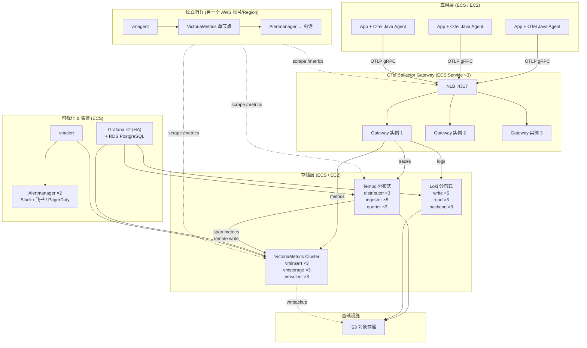

# 生产环境部署架构

基于 10 万样本/秒的容量规划，覆盖 Metrics / Traces / Logs 三大信号的完整生产方案。

## 流量估算

| 信号 | 流量 | 说明 |
|------|------|------|
| Metrics | ~50K samples/s | 100+ 服务 × 500 时间序列/服务 × 15s 采集间隔 |
| Traces | ~30K spans/s | ~10K req/s × 3 avg spans/trace |
| Logs | ~20K lines/s | 100+ 服务 × 200 lines/s/服务 |

## 部署环境

- **应用服务**：AWS ECS / EC2 部署
- **可观测性组件**：ECS 服务或 EC2 实例部署
- **存储**：S3 对象存储
- **网络**：所有组件在同一 VPC 内，通过 Service Discovery / NLB 通信

## 整体架构



**架构说明：App 通过 NLB 直连 OTel Gateway，无 Agent 层。** ECS/EC2 环境没有 DaemonSet 概念，加 Agent sidecar 增加运维负担且收益不大。Gateway 前置 NLB 做负载均衡，App 端只需配一个 NLB 地址。

## 组件详细配置

### 1. OTel Collector Gateway (ECS Service)

App 通过 NLB 直连 Gateway，无 Agent 层。Gateway 负责 tail_sampling、路由到不同后端。

**部署配置：**

| 项目 | 值 |
|------|-----|
| 部署方式 | ECS Service（或 EC2 ASG） |
| 实例数 | 3（ASG: 3-8，按 CPU 扩缩） |
| 实例规格 | 8 vCPU / 16 GiB (如 c6i.2xlarge) |
| 前置 LB | NLB，监听 4317 (gRPC)，target group 指向 Gateway 实例 |

**Java 服务端配置（唯一改动）：**

```yaml
OTEL_EXPORTER_OTLP_ENDPOINT: http://otel-gateway-nlb.internal:4317
OTEL_EXPORTER_OTLP_PROTOCOL: grpc
```

**配置：**

```yaml
receivers:
  otlp:
    protocols:
      grpc:
        endpoint: 0.0.0.0:4317

processors:
  memory_limiter:
    check_interval: 1s
    limit_mib: 12000
    spike_limit_mib: 3000
  batch:
    timeout: 5s
    send_batch_size: 4096

  # Trace 差异化采样
  tail_sampling:
    decision_wait: 10s
    num_traces: 200000
    expected_new_traces_per_sec: 10000
    policies:
      # 错误 trace 100% 保留
      - name: always-keep-errors
        type: status_code
        status_code:
          status_codes: [ERROR]

      # 慢请求 (>1s) 100% 保留
      - name: always-keep-slow
        type: latency
        latency:
          threshold_ms: 1000

      # 健康检查 — 丢弃
      - name: drop-health-checks
        type: and
        and:
          and_sub_policy:
            - name: is-health
              type: string_attribute
              string_attribute:
                key: http.route
                values: [/actuator/health, /actuator/prometheus, /health, /ready]
            - name: drop
              type: probabilistic
              probabilistic:
                sampling_percentage: 0

      # 核心服务 — 高采样率
      - name: critical-services
        type: and
        and:
          and_sub_policy:
            - name: is-critical
              type: string_attribute
              string_attribute:
                key: service.name
                values: [payment-service, auth-service]
            - name: sample-50
              type: probabilistic
              probabilistic:
                sampling_percentage: 50

      # 写入接口 — 中等采样率
      - name: write-apis
        type: and
        and:
          and_sub_policy:
            - name: is-write
              type: string_attribute
              string_attribute:
                key: http.method
                values: [POST, PUT, DELETE]
            - name: sample-20
              type: probabilistic
              probabilistic:
                sampling_percentage: 20

      # 兜底 — 低采样率
      - name: default
        type: probabilistic
        probabilistic:
          sampling_percentage: 5

exporters:
  # Traces → Tempo
  otlphttp/tempo:
    endpoint: http://tempo-distributor.internal:4318
    sending_queue:
      enabled: true
      queue_size: 10000
      storage:
        directory: /var/otel/queue/traces
        max_size_mib: 2048
    retry_on_failure:
      enabled: true
      max_elapsed_time: 300s

  # Logs → Loki
  otlphttp/loki:
    endpoint: http://loki-gateway.internal:3100/otlp
    sending_queue:
      enabled: true
      queue_size: 10000
      storage:
        directory: /var/otel/queue/logs
        max_size_mib: 2048
    retry_on_failure:
      enabled: true
      max_elapsed_time: 300s

  # Metrics → VictoriaMetrics (OTLP 原生接收)
  otlphttp/victoria:
    endpoint: http://vminsert.internal:8480/insert/0/opentelemetry
    sending_queue:
      enabled: true
      queue_size: 10000
    retry_on_failure:
      enabled: true
      max_elapsed_time: 300s

extensions:
  health_check:
    endpoint: 0.0.0.0:13133

service:
  extensions: [health_check]
  pipelines:
    traces:
      receivers: [otlp]
      processors: [memory_limiter, tail_sampling, batch]
      exporters: [otlphttp/tempo]
    metrics:
      receivers: [otlp]
      processors: [memory_limiter, batch]
      exporters: [otlphttp/victoria]
    logs:
      receivers: [otlp]
      processors: [memory_limiter, batch]
      exporters: [otlphttp/loki]
```

### 3. VictoriaMetrics Cluster（替代 Prometheus）

**选择 VM 而非 Mimir 的理由：**
- 3 个组件 vs Mimir 6 个，运维更简单
- 内存占用低 30-50%
- 原生支持 OTLP 接收，省去格式转换
- PromQL 完全兼容，Dashboard 零改动

**Helm values (victoria-metrics-cluster)：**

```yaml
vminsert:
  replicas: 3
  resources:
    requests: { cpu: "2", memory: "4Gi" }
    limits:   { cpu: "4", memory: "8Gi" }
  extraArgs:
    maxLabelsPerTimeseries: 40
    # 开启 OTLP 接收
    opentsdbHTTPListenAddr: ""

vmstorage:
  replicas: 3
  resources:
    requests: { cpu: "4", memory: "16Gi" }
    limits:   { cpu: "8", memory: "32Gi" }
  persistentVolume:
    size: 500Gi
    storageClass: gp3-ssd
  extraArgs:
    retentionPeriod: 30d
    dedup.minScrapeInterval: 15s
    search.maxUniqueTimeseries: 5000000

vmselect:
  replicas: 3
  resources:
    requests: { cpu: "2", memory: "8Gi" }
    limits:   { cpu: "4", memory: "16Gi" }
  extraArgs:
    search.maxConcurrentRequests: 32
    search.maxQueueDuration: 30s
    search.maxSamplesPerQuery: 100000000
```

**自监控指标采集 (vmagent)：**

```yaml
# 独立的 vmagent 采集所有组件自身 /metrics
# 使用 AWS Cloud Map / static_configs / EC2 SD
scrape_configs:
  - job_name: vminsert
    dns_sd_configs:
      - names: ["vminsert.internal"]
        type: A
        port: 8480
  - job_name: vmstorage
    dns_sd_configs:
      - names: ["vmstorage.internal"]
        type: A
        port: 8482
  - job_name: vmselect
    dns_sd_configs:
      - names: ["vmselect.internal"]
        type: A
        port: 8481
  - job_name: otel-gateway
    dns_sd_configs:
      - names: ["otel-gateway.internal"]
        type: A
        port: 8888
  - job_name: tempo
    dns_sd_configs:
      - names:
          - "tempo-distributor.internal"
          - "tempo-ingester.internal"
          - "tempo-querier.internal"
        type: A
        port: 3200
  - job_name: loki
    dns_sd_configs:
      - names:
          - "loki-write.internal"
          - "loki-read.internal"
          - "loki-backend.internal"
        type: A
        port: 3100
  - job_name: grafana
    dns_sd_configs:
      - names: ["grafana.internal"]
        type: A
        port: 3000

remote_write:
  - url: http://vminsert.internal:8480/insert/0/prometheus/api/v1/write
```

### 4. Grafana Tempo — 分布式模式

**Helm values (tempo-distributed)：**

```yaml
global:
  storage:
    trace:
      backend: s3
      s3:
        bucket: tempo-traces
        endpoint: s3.cn-east-1.amazonaws.com
        region: cn-east-1

distributor:
  replicas: 3
  resources:
    requests: { cpu: "2", memory: "4Gi" }

ingester:
  replicas: 5
  resources:
    requests: { cpu: "4", memory: "8Gi" }
  config:
    max_block_duration: 10m

querier:
  replicas: 3
  resources:
    requests: { cpu: "2", memory: "4Gi" }

queryFrontend:
  replicas: 2
  resources:
    requests: { cpu: "1", memory: "2Gi" }

compactor:
  replicas: 2
  config:
    compaction:
      block_retention: 336h  # 14 天

# Span metrics → 推送到 VictoriaMetrics 生成 RED 指标
metricsGenerator:
  enabled: true
  replicas: 2
  config:
    processor:
      service_graphs:
        dimensions: [service.name]
      span_metrics:
        dimensions: [service.name, http.method, http.route]
    storage:
      remote_write:
        - url: http://vminsert:8480/insert/0/prometheus/api/v1/write

# 多租户
multitenancyEnabled: true
```

### 5. Grafana Loki — 分布式模式

**Helm values (loki)：**

```yaml
loki:
  schemaConfig:
    configs:
      - from: "2024-01-01"
        store: tsdb
        object_store: s3
        schema: v13
        index:
          prefix: loki_index_
          period: 24h

  storage:
    type: s3
    s3:
      s3: s3://loki-logs
      region: cn-east-1

  limits_config:
    ingestion_rate_mb: 100
    ingestion_burst_size_mb: 200
    max_query_parallelism: 32
    retention_period: 168h          # 7 天热数据
    allow_structured_metadata: true

write:
  replicas: 5
  resources:
    requests: { cpu: "2", memory: "4Gi" }
    limits:   { cpu: "4", memory: "8Gi" }

read:
  replicas: 3
  resources:
    requests: { cpu: "2", memory: "8Gi" }
    limits:   { cpu: "4", memory: "16Gi" }

backend:
  replicas: 3
  resources:
    requests: { cpu: "1", memory: "2Gi" }
    limits:   { cpu: "2", memory: "4Gi" }
```

### 6. Grafana — HA 部署 + 多租户隔离

```yaml
# Helm values (grafana)
replicas: 2

persistence:
  enabled: false   # 状态存 PostgreSQL

database:
  type: postgres
  host: grafana-postgres:5432
  name: grafana
  user: grafana
  password:
    secretKeyRef:
      name: grafana-db-secret
      key: password

grafana.ini:
  server:
    root_url: https://grafana.example.com

  # SSO 集成，自动分配用户到对应 Org
  auth.generic_oauth:
    enabled: true
    name: SSO
    client_id: grafana
    scopes: openid profile email groups
    auth_url: https://sso.example.com/authorize
    token_url: https://sso.example.com/token
    api_url: https://sso.example.com/userinfo
    org_attribute_path: groups
    org_mapping: "platform:1:Admin, team-a:2:Editor, team-b:3:Editor"

  users:
    auto_assign_org: false

  feature_toggles:
    enable: traceqlEditor tempoServiceGraph
```

**数据源隔离 — 每个 Org 独立 datasource：**

```yaml
# Org 1: Platform Team (Admin, 全局视角)
datasources:
  - name: VictoriaMetrics
    type: prometheus
    url: http://vmselect:8481/select/0/prometheus
    jsonData:
      exemplarTraceIdDestinations:
        - name: trace_id
          datasourceUid: tempo

  - name: Tempo
    type: tempo
    url: http://tempo-query-frontend:3200

  - name: Loki
    type: loki
    url: http://loki-gateway:3100
---
# Org 2: Team A (只能看自己租户的数据)
datasources:
  - name: VictoriaMetrics
    type: prometheus
    url: http://vmselect:8481/select/0/prometheus
    jsonData:
      customQueryParameters: "extra_label=tenant%3Dteam-a"
      exemplarTraceIdDestinations:
        - name: trace_id
          datasourceUid: tempo

  - name: Tempo
    type: tempo
    url: http://tempo-query-frontend:3200
    jsonData:
      httpHeaderName1: X-Scope-OrgID
    secureJsonData:
      httpHeaderValue1: team-a

  - name: Loki
    type: loki
    url: http://loki-gateway:3100
    jsonData:
      httpHeaderName1: X-Scope-OrgID
    secureJsonData:
      httpHeaderValue1: team-a
```

### 7. 告警体系

**vmalert 规则：**

```yaml
groups:
  # ===== 业务告警 =====
  - name: business-slo
    interval: 30s
    rules:
      - alert: HighErrorRate
        expr: |
          sum(rate(http_server_request_duration_seconds_count{http_response_status_code=~"5.."}[5m])) by (service_name)
          / sum(rate(http_server_request_duration_seconds_count[5m])) by (service_name)
          > 0.05
        for: 3m
        labels: { severity: critical }
        annotations:
          summary: "{{ $labels.service_name }} 错误率超过 5%"

      - alert: HighP99Latency
        expr: |
          histogram_quantile(0.99,
            sum(rate(http_server_request_duration_seconds_bucket[5m])) by (le, service_name)
          ) > 2
        for: 3m
        labels: { severity: warning }
        annotations:
          summary: "{{ $labels.service_name }} P99 延迟超过 2 秒"

  # ===== 可观测性组件自身告警 =====
  - name: observability-stack
    interval: 30s
    rules:
      - alert: OTelCollectorSpanDropping
        expr: rate(otelcol_exporter_send_failed_spans_total[5m]) > 0
        for: 2m
        labels: { severity: critical }
        annotations:
          summary: "OTel Collector span 导出失败"

      - alert: VMStorageDiskLow
        expr: vm_free_disk_bytes / vm_available_disk_bytes < 0.15
        for: 5m
        labels: { severity: critical }
        annotations:
          summary: "vmstorage {{ $labels.instance }} 磁盘剩余不足 15%"

      - alert: TempoIngesterFlushFailing
        expr: rate(tempo_ingester_failed_flushes_total[5m]) > 0
        for: 3m
        labels: { severity: critical }
        annotations:
          summary: "Tempo ingester flush 失败, trace 可能丢失"

      - alert: LokiIngestionNearLimit
        expr: |
          rate(loki_distributor_lines_received_total[5m])
          > on() group_left() (loki_distributor_ingestion_rate_limit * 0.8)
        for: 3m
        labels: { severity: warning }
        annotations:
          summary: "Loki 接近写入速率限制"

      - alert: ComponentDown
        expr: up{job=~"otel-gateway|vminsert|vmstorage|vmselect|tempo|loki|grafana"} == 0
        for: 1m
        labels: { severity: critical }
        annotations:
          summary: "{{ $labels.job }} {{ $labels.instance }} 宕机"
```

### 8. 独立哨兵（外部集群）

部署在主集群之外，防止主监控平面全部不可用时无人知晓。

```yaml
# 单独的 VM 或另一个 K8s 集群
# 极简部署: vmagent + vmsingle + vmalert + alertmanager
services:
  vmagent-sentinel:
    image: victoriametrics/vmagent:latest
    # 通过公网/VPN 采集主集群各组件 /metrics
    # 只保留 up + 核心吞吐指标

  vmsingle-sentinel:
    image: victoriametrics/victoria-metrics:latest
    # 7 天保留, 单节点足够

  vmalert-sentinel:
    image: victoriametrics/vmalert:latest
    # 只有 2 条规则:
    #   1. 主平面组件是否可达
    #   2. 主 VM 是否有数据流入

  alertmanager-sentinel:
    image: prom/alertmanager:latest
    # 告警通道: PagerDuty / 电话
    # 与主平面的 Alertmanager 使用不同通道
```

**哨兵规则（仅关注"主平面是否还活着"）：**

```yaml
groups:
  - name: sentinel
    rules:
      - alert: MainStackUnreachable
        expr: up == 0
        for: 2m
        labels: { severity: page }
        annotations:
          summary: "主监控平面 {{ $labels.job }} 不可达"

      - alert: MainStackNoDataFlow
        expr: rate(vm_rows_inserted_total[5m]) == 0
        for: 5m
        labels: { severity: page }
        annotations:
          summary: "主 VictoriaMetrics 5 分钟无数据写入"
```

## 资源汇总

| 组件 | 实例数 | 推荐实例规格 | 总 vCPU | 总 Memory |
|------|--------|-------------|---------|-----------|
| OTel Gateway | 3 | c6i.2xlarge (8c/16G) | 24c | 48Gi |
| vminsert | 3 | c6i.xlarge (4c/8G) | 12c | 24Gi |
| vmstorage | 3 | r6i.2xlarge (8c/64G) + 500G gp3 | 24c | 192Gi |
| vmselect | 3 | r6i.xlarge (4c/32G) | 12c | 96Gi |
| vmagent (自监控) | 1 | t3.small (2c/2G) | 2c | 2Gi |
| vmalert | 1 | t3.small (2c/2G) | 2c | 2Gi |
| Tempo distributor | 3 | c6i.xlarge (4c/8G) | 12c | 24Gi |
| Tempo ingester | 5 | r6i.xlarge (4c/32G) | 20c | 160Gi |
| Tempo querier | 3 | c6i.xlarge (4c/8G) | 12c | 24Gi |
| Tempo query-frontend | 2 | c6i.large (2c/4G) | 4c | 8Gi |
| Tempo compactor | 2 | c6i.xlarge (4c/8G) | 8c | 16Gi |
| Tempo metrics-generator | 2 | c6i.xlarge (4c/8G) | 8c | 16Gi |
| Loki write | 5 | c6i.xlarge (4c/8G) | 20c | 40Gi |
| Loki read | 3 | r6i.xlarge (4c/32G) | 12c | 96Gi |
| Loki backend | 3 | c6i.large (2c/4G) | 6c | 12Gi |
| Grafana | 2 | t3.medium (2c/4G) | 4c | 8Gi |
| Alertmanager | 2 | t3.small (2c/2G) | 4c | 4Gi |
| RDS PostgreSQL (Grafana) | 1 | db.t3.small | - | - |
| **总计** | **~47 台** | | **~186c** | **~772Gi** |
| 哨兵 (另一个 Region) | 1 | t3.medium (2c/4G) | 2c | 4Gi |

> **成本优化提示：**
> - vmstorage / Tempo ingester / Loki read 是内存大户，用 r6i (内存优化) 实例
> - 无状态组件 (Gateway/distributor/querier) 可用 Spot 实例降 60-70% 成本
> - vmagent / vmalert / Alertmanager 可合并到同一台 t3.medium

### 存储估算（月）

| 类型 | 存储 | 保留期 | 月成本 |
|------|------|--------|--------|
| vmstorage (gp3 EBS) | 500Gi × 3 | 30 天 | ~$120 |
| Tempo traces (S3) | ~1.5TB | 14 天 | ~$35 |
| Loki logs (S3) | ~3TB | 7 天热 + 30 天冷 | ~$50 |
| RDS PostgreSQL | 20Gi | - | ~$30 |
| **总计** | | | **~$235/月** |

### EC2 月成本估算（us-east-1 On-Demand）

| 分类 | 实例数 × 规格 | 月成本 |
|------|-------------|--------|
| OTel Gateway | 3 × c6i.2xlarge | ~$735 |
| VictoriaMetrics | 3+3+3 × 混合 | ~$1,800 |
| Tempo | 15 × 混合 | ~$2,400 |
| Loki | 11 × 混合 | ~$1,500 |
| Grafana + 告警 | 5 × t3.small/medium | ~$180 |
| 存储 (EBS + S3) | - | ~$235 |
| **总计** | | **~$6,850/月** |
| **用 Spot (无状态组件)** | | **~$4,500/月** |

## ECS / EC2 部署规划

```
VPC: 10.0.0.0/16
├── Private Subnet (可观测性组件)
│   ├── ECS Service: otel-gateway ×3      ← NLB 4317 (gRPC)
│   ├── EC2 ASG: vmstorage ×3             ← 需要固定 EBS 卷
│   ├── ECS Service: vminsert ×3          ← 内部 NLB
│   ├── ECS Service: vmselect ×3          ← 内部 NLB
│   ├── ECS Service: tempo-distributor ×3
│   ├── EC2 ASG: tempo-ingester ×5        ← 需要本地 WAL 磁盘
│   ├── ECS Service: tempo-querier ×3
│   ├── ECS Service: loki-write ×5
│   ├── ECS Service: loki-read ×3
│   ├── ECS Service: grafana ×2           ← ALB 3000 (HTTPS)
│   └── ECS Service: alertmanager ×2
│
├── Private Subnet (业务服务)
│   ├── ECS Service: order-service ×N
│   ├── ECS Service: inventory-service ×N
│   └── ...
│
└── Public Subnet
    ├── NLB: otel-gateway-nlb (内部)
    └── ALB: grafana-alb (HTTPS, 带 Cognito/OIDC 认证)

Service Discovery:
  - AWS Cloud Map 或内部 DNS
  - otel-gateway-nlb.internal → NLB
  - vminsert.internal → vminsert NLB
  - tempo-distributor.internal → ECS Service Discovery
  - loki-gateway.internal → ECS Service Discovery
  - grafana.example.com → ALB (公网)

有状态组件用 EC2 ASG (需要 EBS 持久卷):
  - vmstorage: gp3 500Gi
  - tempo-ingester: gp3 100Gi (WAL)
  
无状态组件用 ECS Fargate 或 EC2 Spot:
  - 其余所有组件
```

## 数据保留策略

| 信号 | 热数据 | 冷数据 | 策略 |
|------|--------|--------|------|
| Metrics | 30 天 (vmstorage SSD) | 可选 vmbackup → S3 (1年) | vmstorage `retentionPeriod=30d` |
| Traces | 14 天 (S3 标准) | 无 | Tempo `block_retention=336h` |
| Logs | 7 天 (S3 标准) | 30 天 (S3 IA) | Loki `retention_period=168h` + S3 lifecycle |

## 采样策略效果

| 场景 | 原始 spans/s | 采样后 | 保留率 |
|------|-------------|--------|--------|
| 错误请求 | ~100 | 100 | 100% |
| 慢请求 (>1s) | ~200 | 200 | 100% |
| 健康检查 | ~5,000 | 0 | 0% |
| 核心服务 (支付/鉴权) | ~3,000 | 1,500 | 50% |
| 写入接口 (POST/PUT/DELETE) | ~5,000 | 1,000 | 20% |
| 其他正常读请求 | ~17,000 | 850 | 5% |
| **总计** | **~30,000** | **~3,650** | **~12%** |

存储成本降至原始的 **12%**，但所有有价值的 trace（错误 + 慢请求）100% 保留。

## 信号关联配置

三大信号通过以下方式关联跳转：

```
Metrics (Exemplar)  ──trace_id──▶  Trace  ──service.name──▶  Logs
    ▲                                │                          │
    │                                │                          │
    └────── span metrics ◀───────────┘      traceID link ◀──────┘
```

| 跳转路径 | 实现方式 |
|----------|---------|
| Metrics → Trace | VictoriaMetrics exemplar 存储 `trace_id`, Grafana 点击跳转 Tempo |
| Trace → Logs | Tempo datasource `tracesToLogsV2` 配置, 按 traceID 过滤 Loki |
| Logs → Trace | Loki datasource `derivedFields` 正则匹配 traceID, 跳转 Tempo |
| Trace → Metrics | Tempo datasource `tracesToMetrics` 配置, 查询关联 RED 指标 |
| Trace → Service Graph | Tempo metrics-generator 生成 `traces_service_graph_*` 指标 |

## 从 Demo 迁移清单

| 步骤 | 工作内容 | 改动量 |
|------|---------|--------|
| 1 | VPC + Subnet + Security Group 准备 | 基础设施 |
| 2 | 创建 S3 存储桶 (tempo-traces, loki-logs) + IAM Role | 基础设施 |
| 3 | 部署 VictoriaMetrics Cluster (EC2 ASG + ECS) | 新增 |
| 4 | 部署 Tempo Distributed (EC2 + ECS) | 替换 demo 单节点 |
| 5 | 部署 Loki (ECS) | 替换 demo 单节点 |
| 6 | 部署 OTel Gateway (ECS) + NLB | 替换 demo 单节点 |
| 7 | 部署 Grafana (ECS) + RDS PostgreSQL + ALB | 替换 demo 单节点 |
| 8 | 配置 vmalert 告警规则 + Alertmanager | 新增 |
| 9 | 部署独立哨兵 (另一个 Region) | 新增 |
| 10 | **Java 服务改造** | **零代码改动**, 仅改环境变量 |

Java 服务端（ECS Task Definition）唯一的变更：

```yaml
# 原来 (Demo)
OTEL_EXPORTER_OTLP_ENDPOINT: http://otel-collector:4317

# 生产
OTEL_EXPORTER_OTLP_ENDPOINT: http://otel-gateway-nlb.internal:4317
```

代码零改动 — 这就是 OTel Java Agent 零代码 instrumentation 的优势。
